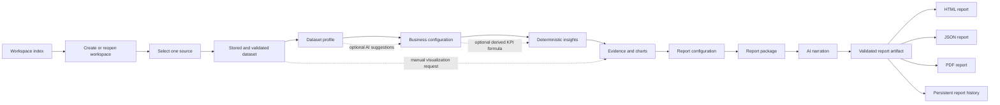

# User Input to Output

This document follows one report from the first uploaded file to the final HTML, JSON, and PDF outputs. It explains where user input enters the system, how it is validated and transformed, which artifacts are written, and how later stages trace their results back to earlier evidence.

For the responsibilities and public API of each Python file, see [MODULE_REFERENCE.md](MODULE_REFERENCE.md). For the higher-level design and artifact graph, see [../ARCHITECTURE.md](../ARCHITECTURE.md).

## Core mental model

The application is a local, artifact-driven pipeline:

1. A user creates or reopens a workspace.
2. A new workspace receives a random `dataset_id` before it has a source.
3. The user attaches one supported source; the same ID becomes its safe
   filename stem. The compatible upload-first route performs steps 2 and 3
   together.
4. Every configuration, insight, chart, report package, and generated report is stored under that same identity.
5. Each stage reads validated output from earlier stages instead of passing a large in-memory object through every page.
6. AI is used only at bounded stages. Python code validates its structured responses before they can become application artifacts.
7. Deterministic evidence remains the source of truth for report numbers.

There is no application database. The filesystem is the persistence layer, and `dataset_id` is the key that connects the artifacts.
Consequently, `instance/` is now durable project data rather than a disposable
cache. It must be included in backups if workspace recovery is required.



## Artifact identity and storage

The default data directory is controlled by the application configuration. Within it, each artifact type has its own directory.

| Artifact | Typical storage location | Written by | Read by |
| --- | --- | --- | --- |
| Uploaded dataset | `uploads/<dataset_id>.<extension>` | Dataset ingestion | Profiling, insights, visualizations |
| Workspace identity/lifecycle | `workspaces/<dataset_id>.json` | Workspace creation, source attachment, and lifecycle routes | Workspace index, detail, and report access checks |
| Workbook selection | `uploads/<dataset_id>.selection.json` | Sheet-selection route | Dataset loader |
| Business configuration | `configurations/<dataset_id>.json` | Configuration routes | Insights and downstream report stages |
| Insight set | `insights/<dataset_id>.json` | Insight generation | Evidence layer and report configuration |
| Evidence set | `evidence/<dataset_id>.json` | Evidence generation | Report package builder |
| Generated chart | Chart output directory | Evidence and visualization builders | Browser, report renderer, PDF builder |
| Manual visualization specification | Manual visualization artifact directory | Manual visualization confirmation | Manual evidence and report selection |
| Report configuration | `report_configurations/<dataset_id>.json` | Report configuration route | Package builder |
| Report package | `report_packages/<dataset_id>.json` | Report package builder | Narration generator |
| Generated report | `generated_reports/<dataset_id>/V####-<report_id>.json` | Report generation | HTML, JSON, PDF, publishing |
| Historical report charts | `generated_report_assets/<dataset_id>/V####-<report_id>/` | Report version save | Historical HTML and PDF |
| Published-report state | Generated-report metadata/artifact state | Publishing routes | Published report view |
| Model-run benchmark | `model_run_metrics/model_runs.csv` | Every measured Ollama request | Offline prompt-performance comparison |
| Recoverably deleted source | `trash/sources/<dataset_id>/` | Source archive route | Source restore route |

Exact roots are initialized in `src/insight_reporter/app.py`; callers should
use the Flask configuration keys rather than hard-coding these examples.

## End-to-end request flow

### 1. Workspace creation or selection

**Browser input**

- A workspace name and optional description, or a click on an existing
  workspace.

**Route**

- `GET /` redirects to `GET /workspaces`.
- `POST /workspaces` creates an empty workspace.
- `GET /workspaces/<dataset_id>` displays source state, progress, reports, and
  the next valid action.

**Transformation**

1. `create_empty_workspace()` validates bounded presentation text.
2. Python allocates a 32-character random identity and checks that no metadata
   file already uses it.
3. Schema-2 workspace JSON is written atomically with no source fields.
4. `get_workspace_summary()` reports `source_required`; the workspace appears
   in the index even though no upload file exists.

**Output**

- `workspaces/<dataset_id>.json`.
- A stable workspace detail URL and a source-selection action.

### 1B. Source selection and attachment

**Browser input**

- Exactly one CSV, flat JSON, or XLSX file selected from the workspace.

**Route**

- `GET /workspaces/<dataset_id>/source` renders source selection only for an
  active empty workspace.
- `POST /workspaces/<dataset_id>/source` validates and attaches the source.
- `GET/POST /upload` remains the compatible upload-first path; it creates
  source and workspace metadata in one operation.

**Transformation**

1. The route confirms the workspace exists, is active, and has no source.
2. `dataset_ingestion.ingest_dataset(..., dataset_id=dataset_id)` performs the
   normal size, extension, real-format, shape, and content checks.
3. The validated source is atomically promoted as
   `uploads/<dataset_id>.<extension>`.
4. `DatasetUploadResult` supplies the detected format, source fingerprint,
   byte size, shape, and worksheet names.
5. `attach_workspace_source()` verifies the safe filename belongs to the
   workspace and adds source metadata without changing its name, description,
   or identity.
6. If attachment fails, the just-created source is removed so an empty
   workspace never falsely appears source-backed.

**Output**

- A stored source file attached to the existing workspace.
- Updated schema-2 workspace metadata.
- A redirect to sheet selection for a multi-sheet workbook, or directly to the dataset workflow for an immediately loadable source.

The uploaded filename is presentation metadata. Later code should locate the dataset through the `dataset_id`, not trust a browser-supplied path.

### 2. Excel sheet selection

This stage exists only when an uploaded workbook has more than one usable sheet.

**Browser input**

- The chosen worksheet name.

**Transformation**

1. The workbook sheet names are read safely.
2. The submitted sheet name is checked against that list.
3. The selection is written as a small JSON sidecar.

**Output**

- `<dataset_id>.selection.json`.
- A redirect into the normal profiling workflow.

From this point onward, `dataset_view.load_dataset_view()` applies the saved selection whenever it reads the workbook.

### 3. Dataset loading and profiling

`DatasetView` is the shared, format-independent representation used by downstream modules.

**Input**

- Stored CSV, JSON, or selected Excel sheet.

**Transformation**

1. `dataset_view.load_dataset_view()` resolves the stored file.
2. The source-specific reader loads it into a tabular structure.
3. Column names and source metadata are normalized.
4. `dataset_profile.profile_dataset()` computes deterministic metadata such as:
   - row and column counts;
   - inferred column types;
   - missing-value counts;
   - uniqueness/cardinality information;
   - numeric summaries;
   - categorical summaries;
   - date-like ranges where available.

**Output**

- A `DatasetView` for computation.
- A `DatasetProfile` for display and AI context.
- A profile page containing a safe preview and configuration entry points.

Profiling is deterministic: the same stored dataset and selected sheet produce the same profile.

### 4. Optional AI-assisted source suggestions

This stage helps the user configure the dataset; it does not silently apply business meaning.

**Browser input**

- A request to generate suggestions.

**AI input**

- Dataset profile metadata.
- Column names, inferred types, and bounded sample information.
- The schema expected from the local Ollama model.

**Transformation**

1. `configuration_suggestions.build_profile_summary()` creates bounded,
   row-free model context.
2. `configuration_suggestions.generate_configuration_suggestions()` builds
   the request and asks Ollama for JSON constrained by
   `build_suggestion_response_schema()`. Each proposal includes a source KPI,
   aggregation, display format, direction, target scope, date/category
   context, objective, confidence, and rationale. The target itself is
   required to be null.
3. `configuration_suggestions.parse_suggestion_response()` parses the
   untrusted JSON and revalidates every suggestion and referenced column.
   Supported-value checks are deterministic; period scope also requires a
   date column and segment scope requires a category column.
4. `model_run_metrics` appends the request duration, official token fields
   when available, prompt version, and validation outcome without copying the
   prompt or response.
5. Valid suggestions are placed into temporary navigation state so they can survive the redirect.

**Output**

- Suggested KPI semantics and context shown to the user in an editable review
  form.
- Numeric targets remain empty until supplied by the user.
- No saved business configuration until the user reviews and submits the form.

If Ollama is unavailable or returns invalid JSON, the application reports the failure and keeps the manual configuration path usable.

### 5. Business configuration

This stage turns raw columns into explicitly approved business semantics.

**Browser input**

- Business objective.
- Selected date/category dimensions.
- Selected source measures.
- For each source KPI: sum/mean/median/min/max aggregation, number/currency/
  percentage display format, higher/lower direction, optional target, and
  whether the target applies per row, period, segment, or complete dataset.
- Optional time column.
- Optional existing/source KPI choices.
- Optional derived or conditional KPI definitions.

**Transformation**

1. The route reads `request.form`.
2. Submitted columns are checked against the current dataset.
3. Names, aggregation choices, and KPI definitions are normalized.
4. `business_config.BusinessConfiguration` and its nested value objects validate the complete configuration.
5. Source settings stay editable on the saved configuration page. Calculated
   KPI aggregation/format fields remain locked to their definitions.
6. The validated schema-6 configuration is serialized to JSON. Schemas 1–5
   are migrated in memory with their previous target meaning preserved.

**Output**

- `configurations/<dataset_id>.json`.

This file is the semantic contract for the rest of the pipeline. Insight generation should never guess which columns are meaningful after this point.

### 6. Optional derived KPI formula

A derived KPI lets the user define a metric calculated from existing columns or approved KPIs.

**Browser input**

- KPI name and description.
- Formula text.
- Display/format metadata where supported.

**Transformation**

1. `formula_engine.tokenize_formula()` recognizes permitted tokens.
2. `formula_engine.parse_formula()` builds an expression tree.
3. Validation rejects unknown identifiers, unsafe syntax, invalid arity, and unsupported operations.
4. `formula_engine.evaluate_formula()` computes a bounded preview using approved values.
5. The confirmation route converts the previewed definition into a saved `DerivedKPI`.

**Output**

- A derived KPI embedded in the business configuration.
- Later calculations can evaluate it through the shared formula engine.

Formulas are parsed by application code; they are not passed to Python `eval`.

### 6B. Optional conditional percentage KPI

Use this path when a numerator is defined by exact values inside a category
column rather than arithmetic over numeric columns.

**Browser input**

- KPI name.
- Calculation base: record count or numeric value sum.
- One categorical/boolean condition column.
- One to twenty exact values displayed from that column.
- A numeric value column for value-share calculations.
- Row-grain confirmation for record-count rates.
- Direction, optional 0–100 target, role, and shared analysis context.

**Transformation**

1. `condition_value_options()` reads bounded exact retained values for the
   checkbox UI.
2. The route accepts values only from the selected condition column.
3. `validate_conditional_metric()` checks the real values, column roles, and
   row-grain confirmation.
4. `validate_conditional_business_configuration()` adds the canonical KPI to
   the one-to-five registry.
5. `evaluate_conditional_metric()` later calculates either matching rows
   divided by all rows or matching value sum divided by total valid value sum.

**Output**

- A schema-1 conditional definition nested in the schema-5 business
  configuration.
- Percentage display format and conditional-rate aggregation fixed by the
  definition.
- No Ollama call.

For example, selecting `Customer_Type = New` and value `Net_Sales` calculates
New revenue divided by all valid Net Sales. Selecting `Status = Returned,
Cancelled` with record count calculates those rows divided by all rows.

### 7. Deterministic insight generation

This is the main analytical stage and the source of report facts.

**Input**

- `DatasetView`.
- Saved `BusinessConfiguration`.
- Optional derived KPI registry.

**Transformation**

1. `_metric_capabilities()` first classifies the KPI as row-level or
   aggregate-only and additive or non-additive. It also considers whether
   confirmed date/category fields exist.
2. `_add_metric_snapshot()` calculates one whole-dataset value, valid/excluded
   support, conditional numerator/denominator values where applicable, and
   explicit analysis coverage.
3. Target scope determines the comparison unit: `row` compares individual
   values; `period` recalculates one aggregate per eligible period; `segment`
   recalculates one aggregate per eligible category value; and `dataset`
   compares only the whole-dataset aggregate.
4. Only structurally valid algorithms run. Aggregate formulas do not attempt
   row anomalies, correlations, or row benchmark breaches.
5. Genuine unmet sample requirements are collected and emitted as one
   actionable diagnostic per KPI rather than many near-identical records.
   Missing columns are similarly consolidated into one dataset-quality
   diagnostic.

`insight_engine.generate_insights()` then applies deterministic analytical
templates that fit the approved columns and data types. Depending on the
configuration, it can produce findings such as:

- whole-dataset KPI snapshots;
- dimension rankings;
- contribution/share findings;
- named shares of additive source KPIs by configured category;
- time trends;
- change and volatility signals;
- concentration or distribution observations;
- comparisons involving derived KPIs.
- conditional record rates or value shares recalculated within each eligible
  dataset, period, segment, and cohort-period group;
- per-region or per-segment target attainment, including the worst segment,
  average target gap, and breach percentage.
- per-period aggregate target status, including the current period gap and
  count of missed periods;
- per-segment aggregate target status, including exact category values,
  best/worst segment, and count of missed segments;
- complete-dataset current-versus-target status without unintended row or
  group comparisons;
- the latest eligible period versus the mean of up to four preceding eligible
  periods, including the exact baseline range and difference;
- like-for-like movement for named category cohorts across the latest two
  periods, including exact previous/current values, absolute/percentage
  change, direction, and best/worst direction-adjusted movement.

Each finding includes structured values and provenance instead of only prose.
Configured category columns supply cohort membership; the engine never guesses
a cohort field. A cohort is included only when it has at least two valid KPI
records in both periods, so absence is not silently converted to zero.

“Not applicable” and “insufficient data” are deliberately different:
structurally unavailable algorithms appear in the KPI snapshot capability
plan, while insufficient diagnostics are produced only when an applicable
analysis lacks the required number of records, periods, segments, cohorts, or
pairs.

**Output**

- `insights/<dataset_id>.json`.
- An insight page that lets the user inspect the calculated results.

AI does not calculate these values. This boundary is important: narration can change wording, but the numerical evidence is reproducible.

An additive source KPI's category-share observation retains each exact
category name, value, record count, and reconciled percentage. A conditional
target observation retains the numerator, denominator, selected target scope,
and the corresponding aggregate comparisons. This is how management
narration can name actual products,
regions, customer types, or statuses without sending raw rows to Ollama.

### 8. Evidence and chart generation

The evidence layer converts insights into report-ready factual units.

**Input**

- Insight set.
- Dataset and configuration metadata.

**Transformation**

1. `evidence_layer.generate_evidence()` selects a suitable evidence
   representation for each supported insight.
2. Table or chart-ready values are normalized.
3. Chart assets are rendered where a visualization is appropriate.
4. Provenance connects each evidence item to its originating insight and source columns.
5. The browser labels ordinary findings, optional non-causal associations, and
   diagnostics separately. Consolidated diagnostic issues become readable
   rows containing available, required, unit, and recommendation fields.

**Output**

- `evidence/<dataset_id>.json`.
- Chart files.
- Evidence records that can be selected for the final report.

An evidence item is more than an image: it is a structured claim, its supporting values, and optional visual presentation.
For 6C, supporting tables preserve the exact baseline period aggregates or
cohort comparison rows. Dedicated charts show the current period against its
recent baseline and each cohort's absolute movement, colored by whether that
movement agrees with the configured KPI direction. Category-share evidence
adds horizontal percentage bars whose labels are the exact retained category
values.

When the user opens a new report configuration, Python selects at most ten
management findings by rank, preserves one finding per configured KPI when
possible, includes at most two correlations, and excludes diagnostics.
Selecting a KPI later selects only evidence marked as recommended. All
associations and diagnostics remain manually selectable for specialist or
appendix use.

### 9. Dashboard and optional manual visualization

The dashboard is available after source profiling and does not require KPI
configuration. It covers questions that are useful to the user but are not
automatically selected by the insight templates.

**Browser input**

- A plain-language goal: trend, group comparison/ranking, relationship,
  distribution, or spread/outliers.
- The business number to explain.
- The date, category, or numeric field used to organize or compare results.
- An editable recommended title and optional decision/question.
- Optional advanced aggregation.
- Optional filters, grouping, sorting, limits, and display choices.

**Transformation**

1. `_default_visualization_form()` preselects a deterministic starting point
   from the reviewed primary KPI or first usable source number and an
   available category/date field.
2. The guided browser layer maps the selected business goal to the existing
   chart type and shows only compatible grouping choices. Advanced controls
   remain available but collapsed.
3. Optionally, `visualization_suggestions.generate_visualization_suggestion()`
   sends bounded semantic metadata and the user's question to Ollama under a
   JSON Schema restricted to real selectors and columns. It does not send raw
   rows.
4. `visualization_suggestions.parse_visualization_suggestion()` runs the
   proposed configuration through the normal visualization parser and
   chart-to-column validator. An invalid proposal is rejected before plotting.
5. `visualization_builder.parse_visualization_spec()` validates and bounds
   the submitted form values independently of browser guidance.
6. `visualization_builder.build_visualization()` resolves source-column and
   record-count measures without a KPI configuration. When configuration
   exists, it also resolves current KPI measures. Python applies the requested
   aggregation and transformations and renders a draft chart.
7. The preview is rendered without yet making it report evidence. An
   Ollama-assisted preview also displays its model, user request, confidence,
   and rationale.
8. On confirmation, the specification and its generated chart are persisted.
9. The dashboard reloads the validated visualization artifacts and displays
   their actual saved PNGs in responsive cards through the protected chart
   route.
10. On a saved chart, `visualization_insights` automatically calculates and
    displays verified Python observations from the retained chart data. The
    page does not ask for questions or invoke Ollama.
11. The insight is saved separately with the exact chart fingerprint. The user
    can keep it dashboard-only or enable report carry-forward.
12. `manual_visualization_evidence.generate_manual_visualization_evidence()`
    converts the confirmed chart into evidence with provenance and appends the
    requested insight only when it is opted in.

A chart saved before KPI configuration remains valid because it is bound to
the immutable source metadata and its selected source columns. When the user
later returns from KPI configuration, saved charts remain listed and the
builder adds the newly configured KPIs to its measure choices. Report
selection can then combine KPIs, deterministic evidence, and dashboard charts.

**Output**

- A saved visualization specification.
- A chart asset rendered directly on the dashboard, with its purpose,
  measures, classification, report status, and management actions.
- A manual evidence item available during report selection.
- Automatically calculated verified observations derived from the saved
  visualization's retained supporting data.

### 9A. Drag-and-drop manual board

Generic **Build a visualization** actions outside the dashboard first open a
chooser with separate Automated Visualization and Build Manual Visualization
destinations. The dashboard keeps both direct buttons so each one opens its
respective builder immediately.

The separate **Build Manual Visualization** workspace loads field groups from
the active data source and lets the user assign X, Y, Legend, Size, and
Secondary Y roles. The browser renders the selected chart immediately, while
the server recalculates and bounds the exact preview data before saving it.
Saving retains a sanitized SVG plus a PNG snapshot without an extra frontend
chart dependency.

In report configuration, each report-ready `MBV-*` artifact is a separate
checkbox. Python derives chart-specific observations from its saved preview;
the narration model sees those observations and bounded supporting points, not
raw source rows. The generated HTML report uses the saved chart route, and the
PNG is retained with each immutable report version for PDF and historical
rendering. Boards saved before PNG export support must be reopened and saved
once before selection.

After saving a board, its detail page shows the bounded supporting points and
automatically displays Python-verified observations from its retained points.
**Include these verified insights in reports** controls whether the observations
accompany the selected board into report evidence.

### 10. Report configuration

This is the editorial selection stage: the user decides what the report should contain.

**Browser input**

- Report title and objective.
- Selected insight/evidence identifiers.
- Ordering and report options.

**Transformation**

1. `report_configuration` checks that every selected identifier exists for the same dataset.
2. Selections are normalized and deduplicated.
3. For every selected chart, the report package reloads only a current,
   fingerprint-matching visualization insight.
4. If its report preference is enabled, its exact Python-verified observations
   are appended to that chart's manual evidence. An observation never enters a
   report without the chart.
3. Required report fields and selection limits are validated.
4. The configuration is saved.

**Output**

- `report_configurations/<dataset_id>.json`.

The browser never submits authoritative evidence values here. It submits identifiers; the server reloads the corresponding stored evidence.

### 11. Report package construction

The report package is the safe boundary between analytics and narration.

**Input**

- Dataset profile summary.
- Business objective and configuration.
- Selected deterministic insights and evidence.
- Report configuration.

**Transformation**

1. `report_generation_package.build_report_generation_package()` reloads selected artifacts.
2. It verifies dataset identity and artifact compatibility.
3. It compacts the selected deterministic and manual evidence into the exact
   bounded input contract required by narration.
4. It excludes raw dataset rows and unnecessary columns.
5. It records fingerprints/provenance needed to detect stale downstream output.

Selected category values are not copied from arbitrary raw rows. Product,
region, channel, or similar names become eligible only when the user configured
that category and a deterministic insight or validated chart retained the
value as evidence.

**Output**

- `report_packages/<dataset_id>.json`.

The report package is the only analytical context the narration layer should need. This makes prompts smaller and limits the chance that the model invents facts from raw data.

### 12. AI report narration and five-point summary

This stage changes structured evidence into readable report prose.

**AI input**

- The bounded report package.
- A strict JSON output schema.
- Instructions to use only supplied evidence and preserve exact numerical meaning.

**Transformation**

1. `report_narration.generate_narrated_report()` groups the highest-priority
   evidence into bounded story packs and creates the structured requests.
2. The local Ollama model returns structured report stories.
3. The narration validator checks schema, evidence references, unsupported claims, numeric grounding, and usable text.
4. Retry/repair logic can request a corrected response when the first output is malformed.
5. The internal `report_narration._generate_executive_summary()` path
   requests exactly five prioritized management findings from the validated
   stories and their Python fact catalog. Each point must say what happened,
   why it matters, and what management should review next. It must quote an
   exact selected value and can name only supplied periods, quarters, regions,
   segments, cohorts, or benchmark conditions. Period-baseline and
   cohort-movement evidence uses the same fact-reference validation as every
   other numerical claim. If that output fails validation,
   `_deterministic_executive_summary()` supplies an explicitly labelled
   fallback.
   When cited evidence contains verified business context, the finding must
   name at least one exact product, region, segment, chart category, cohort, or
   period. Python rejects generic wording that ignores all available context.
6. `GeneratedReport` records AI-generation diagnostics: accepted stories,
   deterministic fallbacks, rejected story packs, summary provenance, and
   active grounding safeguards.
7. Saved-report validation rechecks the complete artifact before HTML, JSON,
   or PDF rendering.
8. Every story attempt and executive-summary attempt appends one model-metrics
   row. Calls from the same report-generation action share a
   `workflow_run_id`; rejected repair attempts remain visible rather than
   being hidden inside the final successful result.

**Output**

- A generated report JSON artifact with:
   - title and objective;
   - exactly five structured executive-summary findings, implications, and
     actions;
   - detailed sections;
   - evidence and chart references;
   - limitations/provenance;
   - schema and version metadata.
   - AI-generation diagnostics.

The five-point summary is not a second independent analysis. It is a concise synthesis of the validated findings already grounded in the report package.

### 12B. Workspace, source, and report lifecycle changes

Successful lifecycle forms use POST followed by a redirect back to a stable
workspace page. Invalid or conflicting lifecycle requests return a safe 4xx
response and leave durable state unchanged.

**Presentation edits**

- `POST /workspaces/<dataset_id>/name` validates and saves workspace name and
  description.
- `POST /workspaces/<dataset_id>/source/name` changes
  `original_filename`, which is now a display label; the safe retained
  filename does not change.
- Source contents are not edited or replaced in place. A different file uses a
  new workspace identity, preventing old calculations and new rows from being
  mixed under one artifact key.
- `POST /workspaces/<dataset_id>/reports/<report_id>/name` stores a
  `report_names` alias in workspace metadata. It never edits
  `V####-<report_id>.json`.
- “Edit report configuration” returns to the deterministic report selection
  form. A subsequent generation creates another immutable report artifact.

**Recoverable delete and restore**

- Workspace archive/restore sets or clears `archived_at`. All dependent files
  stay in place, and archived workspaces are separated on the index.
- Report archive/restore adds or removes the report ID in
  `archived_report_ids`. This hides every version of that generation run from
  active workspace/history lists and blocks ordinary report routes.
- Source archive moves the safe source and optional
  `<dataset_id>.selection.json` into
  `trash/sources/<dataset_id>/`, then sets `source_archived_at`.
- If source metadata cannot be saved, the source move is rolled back. Restore
  performs the inverse move and similarly rolls back on metadata failure.
- Source archival retains configurations, evidence, generated reports, and
  version-specific charts. Exact saved report HTML/JSON/PDF can therefore be
  opened without the current source. Creating or regenerating a report remains
  unavailable until the source is restored.
- The archived-workspace list also offers a separately confirmed permanent
  purge. The route rejects active workspaces, stages exact dataset-owned paths
  before deletion, and removes the source, configuration, evidence, shared
  charts referenced by that workspace, visualizations, reports, report assets,
  and matching transient UI state. Unrelated workspace files remain untouched.

**Backward compatibility**

- Schema-1 workspace JSON is parsed into the expanded in-memory contract.
- A pre-6A source with no workspace JSON receives a safe fallback record in
  read views.
- Immediately before a lifecycle mutation, the route materializes that
  fallback as schema 2 so the requested change has durable state.

### 13. Versioning, regeneration, and publishing

Generated reports are treated as immutable versions.

**Regeneration**

- Reuses the approved report configuration and current compatible upstream artifacts.
- Creates a new report version instead of overwriting the earlier one.
- Allows comparison and recovery if a later narration is weaker.

**Publishing**

- Marks a chosen generated version as the version intended for presentation.
- Does not modify the underlying insight or evidence calculations.

When an upstream artifact changes, fingerprints help the application determine that a downstream package or report must be rebuilt.

**Persistent history**

- `GET /workspaces` scans workspace metadata, retained source files, and
  downstream artifacts to reconstruct every workspace's stage and last
  activity. Scanning metadata is what makes an empty workspace visible.
- New uploads use their saved `WorkspaceRecord`; uploads from before 6A appear
  through a safe fallback name, and renaming one materializes current
  workspace metadata.
- `GET /reports/<dataset_id>/history` validates and lists every generated
  report JSON file, separating report IDs (generation runs) from versions
  (immutable revisions).
- Exact-version routes include the version in the path and call
  `load_generated_report_version()`.
- Historical HTML is read-only: it cannot publish presentation changes or
  regenerate a story.
- Historical JSON and PDF are generated from that exact saved report object,
  not from whichever report is latest today.
- Every newly saved report version atomically snapshots its referenced charts.
  If chart retention fails, the new report JSON is rolled back rather than
  leaving an incomplete history entry.
- A saved report is labelled current when its `source_package_sha256` matches
  the currently rebuildable report package. A mismatch labels it as a
  historical snapshot but does not erase or hide it.

### 14. Final rendering and export

All final formats read from the same validated generated-report artifact.

**HTML**

- The report route loads the selected report version.
- Jinja templates render summary cards, report sections, evidence, charts, and provenance.

**JSON**

- The JSON route returns the structured artifact for inspection, integration, or debugging.

**PDF**

- `report_pdf.build_report_pdf()` converts the report model into a downloadable document.
- It uses the same five-point summary, sections, evidence, and charts as the HTML view.
- PDF export remains a core project output and should be kept when the later UI redesign is implemented.

This shared-source approach prevents three independently generated versions of the report from disagreeing.

## One input traced through the pipeline

Suppose the user uploads sales data, selects `region` as a dimension and `revenue` as a measure, and enters the objective:

> Identify the regions driving revenue and the most important changes over time.

The value evolves as follows:

| Stage | Representation |
| --- | --- |
| Browser form | Plain text objective and selected column names |
| Business configuration | Validated JSON containing the objective, `region`, `revenue`, and optional date field |
| Insight generation | Structured facts such as regional totals, shares, rankings, and time changes |
| Evidence layer | Evidence records with exact values, source insight IDs, and chart data |
| Report configuration | User-selected evidence IDs and desired order |
| Report package | Bounded story packs pairing the objective with only the selected evidence |
| AI narration | Prose that explains the evidence without recalculating it |
| Generated report | Validated sections plus a five-point executive summary |
| HTML/PDF | Presentation formats rendered from that same generated report |

At no stage should the objective itself alter a numeric result. It guides selection and explanation; the dataset, configuration, and deterministic analytics produce the values.

## Browser state and the POST/Redirect/GET pattern

Most editable steps follow this sequence:

1. A `GET` route renders the current saved state.
2. A `POST` route validates submitted form data.
3. On error, a bounded error or form-state payload is stored in navigation state.
4. The route redirects.
5. The next `GET` consumes that state and renders feedback.

`navigation_state.py` centralizes this short-lived state. It prevents large payloads, model responses, and sensitive internal details from being placed directly in query parameters.

Saved project artifacts and navigation state serve different purposes:

- **Artifacts** are durable, reusable pipeline outputs.
- **Navigation state** is temporary browser-flow context such as a validation error or an AI suggestion awaiting review.

## Validation and trust boundaries

| Boundary | What is untrusted | Protection |
| --- | --- | --- |
| File upload | Filename, extension, file contents | Extension checks, generated identity, bounded readers, format validation |
| Workspace metadata | Original filename, display name, persisted JSON | Path-component removal, length/control-character bounds, schema and identity validation |
| Form submission | Column names, IDs, formulas, selections | Server-side dataset lookup and schema validation |
| Formula input | Expression text | Tokenizer/parser, approved functions/operators, no `eval` |
| AI configuration response | Model-produced JSON | Schema and column validation; user confirmation required |
| Manual visualization request | Fields, filters, aggregation, limits | Specification validation against the dataset |
| Report selection | Browser-submitted evidence IDs | Reloaded from server-side artifacts for the same dataset |
| AI narration response | Structure, claims, numbers, references | JSON parsing, schema validation, grounding checks, retry/repair |
| Final export | Report version identifier | Server-side resolution of an existing validated artifact |
| Historical report route | Dataset ID, report ID, version | Exact path construction, filename patterns, full report revalidation, read-only rendering |

## Freshness and invalidation

Downstream artifacts depend on upstream content:

```text
dataset
  -> business configuration
    -> insights
      -> evidence
        -> report configuration
          -> report package
            -> generated report
              -> HTML / JSON / PDF
```

If the dataset or configuration changes, the old insights may no longer be valid. If selected evidence changes, an existing report package and generated narration may be stale. Fingerprints stored with artifacts make these relationships checkable.

A maintainer adding a new stage should:

1. define its exact upstream inputs;
2. store their identifiers or fingerprints;
3. validate them when the artifact is loaded;
4. refuse or rebuild stale output rather than silently mixing versions.

## Failure behavior

The intended failure model is conservative:

- Invalid uploads do not create a usable dataset workflow.
- Invalid workspace-source attachment removes the newly retained file but
  keeps the empty workspace available for another attempt.
- Invalid form input returns the user to the relevant editor with a specific error.
- A bad formula cannot be confirmed.
- An unavailable Ollama service does not corrupt deterministic artifacts.
- Invalid AI JSON is rejected or retried; it is not rendered as a trusted report.
- Missing or stale evidence blocks packaging or generation.
- A PDF failure does not change the saved generated-report artifact.
- Unreadable workspace metadata falls back to safe source-derived identity and
  does not make the retained dataset disappear.
- Recoverable source moves are reversed if the corresponding metadata update
  fails.
- A malformed generated-report artifact is rejected instead of being listed
  as trusted history.

The application log should contain technical diagnostics, while the browser receives a safe and actionable message.

## Troubleshooting map

| Symptom | Inspect first | Then inspect |
| --- | --- | --- |
| Upload rejected | `dataset_ingestion.py` and upload limits | Route error handling and application logs |
| Uploaded dataset absent from workspace list | Retained source filename and ID | `workspace_history.py` discovery and workspace metadata |
| Empty workspace absent from workspace list | `workspaces/<dataset_id>.json` | Schema-2 parsing and workspace-directory configuration |
| Workspace shows a legacy warning | `workspaces/<dataset_id>.json` | Retained source identity and metadata schema |
| Source cannot be restored | `trash/sources/<dataset_id>/` | Conflicting file in `uploads/` and `source_archived_at` |
| Report disappeared | `archived_report_ids` in workspace JSON | Recoverably deleted reports section |
| Wrong Excel data appears | Workbook selection sidecar | `dataset_view.py` sheet loading |
| Column absent from configuration | `dataset_profile.py` type inference | Source-suggestion validation |
| Derived KPI cannot save | `formula_engine.py` parse/validation result | `derived_metrics.py` definition validation |
| Insight numbers look wrong | Saved business configuration | `insight_engine.py` calculation and source rows |
| Period baseline is absent | Number of eligible date groups and valid KPI records | `_add_period_baseline_comparison` minimums |
| Expected cohort is absent | Its record counts in both latest periods | Configured category column and cohort exclusion count |
| Chart disagrees with insight | Evidence JSON values | Evidence chart transformation |
| Manual chart is unavailable in report setup | Saved visualization specification | `manual_visualization_evidence.py` conversion |
| Report selection disappears | Report configuration validation | Evidence identity/fingerprint compatibility |
| AI report fails to generate | Ollama availability and returned JSON | Narration validation/retry logs |
| Prompt revision is slower or less reliable | `model_run_metrics/model_runs.csv` grouped by task, prompt version, model, and workflow | Validation rate, first-attempt success, median latency/token use, and retry count |
| Five-point summary is vague | Selected evidence quality and ordering | Executive-summary prompt/validator |
| HTML and PDF differ | Generated report version loaded by each route | `report_pdf.py` rendering support |
| Old report appears after editing configuration | Upstream/downstream fingerprints | Package and report regeneration path |
| Historical version will not open | Exact `V####-<report_id>.json` artifact | `load_generated_report_version()` identity/schema validation |

## Current product boundaries

- The supported workflow intentionally analyzes one uploaded dataset at a time.
- Multi-file joins and cross-dataset analysis are deferred because they substantially expand identity, schema matching, validation, and testing requirements.
- PDF export is part of the finished workflow, not a temporary feature.
- The final UI redesign is intentionally scheduled after the remaining functional milestones, so visual work targets a stable workflow.

These boundaries should be reconsidered explicitly rather than eroded through isolated route or template changes.
